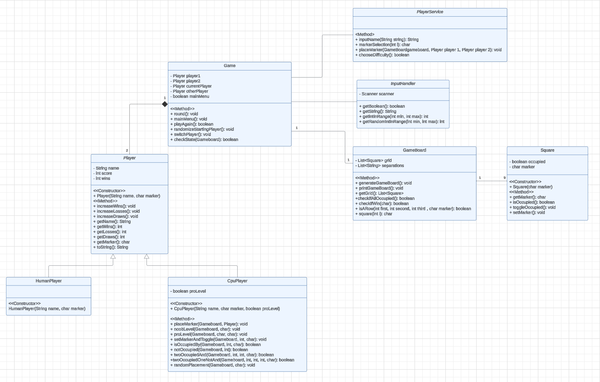

# A simple Tic-Tac-Toe game written in Java

### Textbased and played in the console. Human vs Human or Human vs CPU. Two difficulty levels against the CPU. 
### Good luck, have fun!

##  [Link to UML on Lucid Chart](https://lucid.app/lucidchart/41bd1b6f-a535-44e4-acbf-c95a3e2dd9d9/view?page=0_0&invitationId=inv_35e8946d-5674-4071-98e1-32b6bc3dea9d#)

